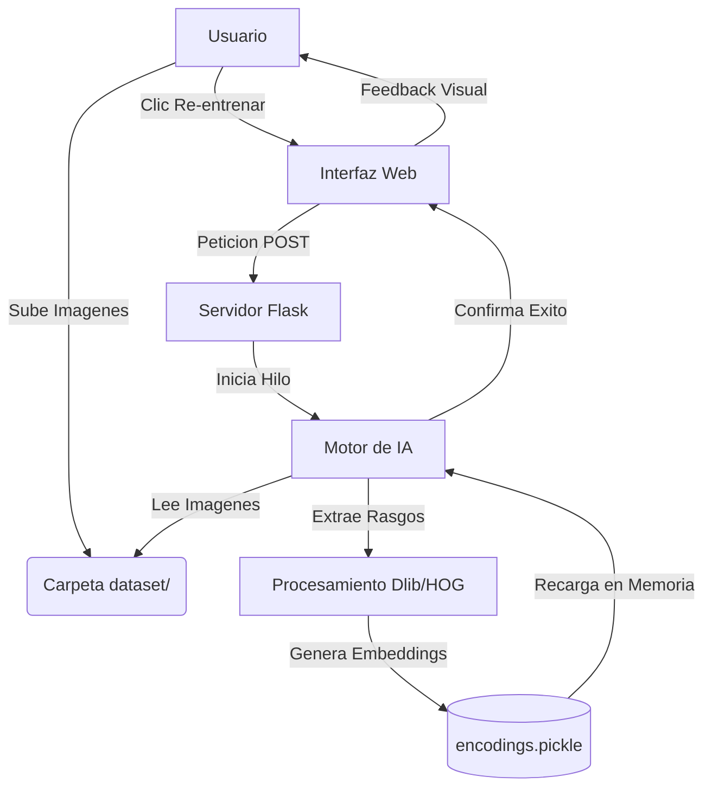

# Solución de Reconocimiento Facial con Arquitectura Web MVC (Trabajo de 2do Bimestre)
**Integrantes:**

*   **Carlos Mejia**
*   **Alex Ramirez**
*   **Sebastian Calderon**

**Profesor:**

*   **Ing. Jorge Lopez Zambrano**

---
Este proyecto implementa una solución completa de reconocimiento facial biométrico utilizando técnicas avanzadas de Deep Learning, encapsuladas en una arquitectura de software moderna Modelo-Vista-Controlador (MVC).

## 1. Introducción y Contexto Académico

El reconocimiento facial es una tecnología biométrica no intrusiva que permite la identificación o verificación de individuos mediante el análisis de características faciales. Este sistema utiliza una arquitectura basada en Redes Neuronales Convolucionales (CNN) para generar "embeddings" (vectores numéricos de 128 dimensiones) que representan de manera única el rostro de una persona.

### Tecnologías Clave Utilizadas
*   **Flask (Backend)**: Framework web ligero que actúa como controlador del sistema, gestionando las rutas HTTP y el streaming de video MJPEG.
*   **OpenCV (Visión)**: Biblioteca estándar para el procesamiento de imágenes en tiempo real y captura de video.
*   **Dlib (IA)**: Núcleo de aprendizaje automático que implementa el detector facial HOG (Histogram of Oriented Gradients) y los modelos de landmarks faciales.
*   **Face_recognition**: Capa de abstracción que facilita las operaciones de comparación de vectores euclidianos.

### Estado del Arte
El proyecto se basa en investigaciones fundamentales en el campo de la visión artificial:
1.  *Histograms of Oriented Gradients for Human Detection* (Dalal & Triggs, 2005): Algoritmo utilizado para la detección inicial de rostros.
2.  *FaceNet: A Unified Embedding for Face Recognition* (Schroff et al., Google, 2015): Base teórica para el uso de triplet loss y embeddings de 128d para identificación precisa.

---

## 2. Arquitectura del Sistema (Design Pattern)

Se ha re-factorizado el código para cumplir con estándares de ingeniería de software, implementando el patrón **MVC**:

### Modelo (`app/models/`)
El núcleo lógico. Aquí reside la inteligencia el sistema.
*   **`facial_recognition.py`**: Clase modular que maneja la carga de la base de datos biométrica (`encodings.pickle`) y realiza la inferencia matemática para comparar rostros en tiempo real.

### Vista (`app/templates/` y `app/static/`)
La interfaz de usuario (UI).
*   **Dashboard Web**: Una interfaz limpia desarrollada en HTML5 y CSS3 que permite monitorizar la cámara en tiempo real y visualizar los metadatos de reconocimiento (nombre, porcentaje de confianza).
*   **Interactividad**: JavaScript asíncrono para comunicarse con el servidor sin recargar la página.

### Controlador (`app/routes/`)
El gestor de tráfico.
*   **`main.py`**: Gestiona las peticiones del cliente, coordina los hilos (threading) para evitar bloqueos durante el entrenamiento y sirve el flujo de video procesado eficientemente.

---

## 3. Manual de Uso

### Instalación
1.  **Clonar el repositorio**:
    ```bash
    git clone https://github.com/tu_usuario/trabajo2bim-recFacial.git
    ```
2.  **Activar entorno virtual**:
    ```powershell
    .\venv\Scripts\activate
    ```
3.  **Instalar dependencias**:
    ```powershell
    pip install -r requirements.txt
    ```

### Ejecución
Para iniciar el servidor web:
```powershell
python run.py
```
Abre tu navegador y ve a: `http://localhost:5000`

### Pipeline de Entrenamiento
El sistema permite la actualización dinámica del modelo. Al agregar nuevas imágenes a la carpeta `dataset/`, el usuario puede disparar el proceso de re-entrenamiento desde la web.



### Gestión de Usuarios (Dataset)
Para agregar una nueva persona al sistema:
1.  Crea una carpeta con el nombre de la persona en `dataset/` (ej: `dataset/Juan_Perez`).
2.  Añade 10-20 fotos claras del rostro de la persona.
3.  Desde el Dashboard web, haz clic en el botón **"Re-entrenar Modelo"**.

---

## 4. Experimentación y Resultados

Para validar la robustez del sistema, se sugiere realizar las siguientes pruebas:

*   **Variación de Iluminación**: Probar el reconocimiento en ambientes con luz contraluz o baja luminosidad.
*   **Oclusión**: Verificar si el sistema reconoce al usuario usando gafas o mascarilla.
*   **Distancia**: Medir la distancia máxima a la que el algoritmo HOG puede detectar un rostro (usualmente < 3 metros con webcam estándar).

## 5. Conclusiones

La implementación de una arquitectura Web/MVC sobre los scripts de reconocimiento facial tradicionales ofrece ventajas significativas:
*   **Centralización**: Todo el control está en un solo dashboard accesible desde cualquier dispositivo en la red local.
*   **Experiencia de Usuario (UX)**: Interfaz gráfica amigable en lugar de comandos de terminal.
*   **Escalabilidad**: La estructura modular permite cambiar el motor de reconocimiento o la interfaz sin afectar al resto del sistema.

---
**Desarrollado para el Trabajo de 2do Bimestre**

